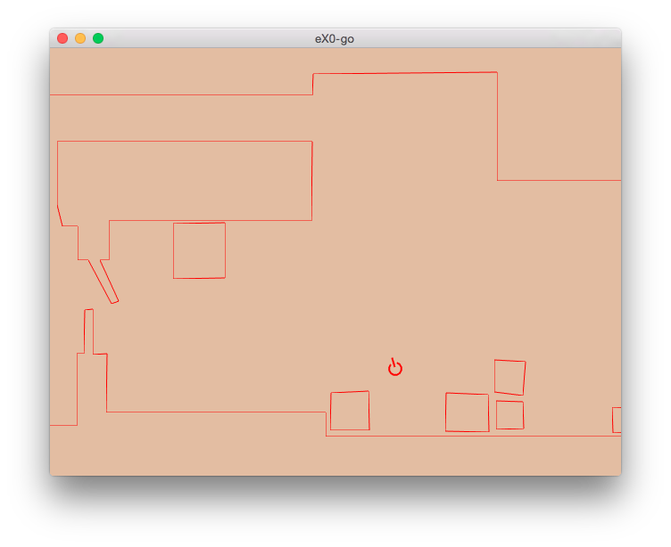

eX0-go
======

[](https://travis-ci.org/shurcooL/eX0) [](https://godoc.org/github.com/shurcooL/eX0/eX0-go)

eX0-go is a work in progress Go implementation of eX0.

The client runs as a native desktop app and in browser.

Installation
------------

You'll need to have OpenGL headers (see [here](https://github.com/go-gl/glfw#installation)).

```
go get -u github.com/shurcooL/eX0/eX0-go
GOARCH=js go get -u -d github.com/shurcooL/eX0/eX0-go
```

Screenshot
----------

The port is incomplete; this screenshot represents the current state.



Usage
-----

```
Usage: eX0-go [flags] [server]-[client]-[view]

Flags:
  -cert string
    	Cert file for wss on server, if empty then ws is used.
  -host string
    	Server host (without port) for client to connect to. (default "localhost")
  -key string
    	Key file for wss on server, if empty then ws is used.
  -name string
    	Local client player name. (default "Unnamed Player")
  -network string
    	Network for client to use (one of "tcp+udp", "tcp-raw", "tcp-ws", "chan"). (default "tcp+udp")
  -secure
    	Secure connection to server (e.g., use wss instead of ws).

Example: eX0-go -host=example.com -name=shaGuar client-view
```

To run a server and client in one:

```
eX0-go server-client-view
```

To run a server with a view:

```
eX0-go server-view
```

To run a dedicated server (command line only, no view):

```
eX0-go server
```

To run a normal client and connect to a server at example.com using TCP+UDP network:

```
eX0-go -host=example.com -network=tcp+udp client-view
```

Browser
-------

The client can run in browser by leveraging [GopherJS](https://github.com/gopherjs/gopherjs#readme) for Go to JavaScript compilation, WebGL for graphics, WebSocket for networking. [Install it](https://github.com/gopherjs/gopherjs#installation-and-usage), then run:

```
gopherjs serve
```

Then open <http://localhost:8080/github.com/shurcooL/eX0/eX0-go> to start up the client.

By default, it will use client-view mode and connect to an eX0-go server at "localhost". You can specify flags via query parameters. E.g., to connect to "example.com" with a player name of "shaGuar", use <http://localhost:8080/github.com/shurcooL/eX0/eX0-go?-host=example.com&-name=shaGuar&client-view>.

Directories
-----------

| Path                                                              | Synopsis                                                                   |
|-------------------------------------------------------------------|----------------------------------------------------------------------------|
| [gpc](https://godoc.org/github.com/shurcooL/eX0/eX0-go/gpc)       | Package gpc parses GPC format files.                                       |
| [packet](https://godoc.org/github.com/shurcooL/eX0/eX0-go/packet) | Package packet is for TCP and UDP packets used in eX0 networking protocol. |
| [render](https://godoc.org/github.com/shurcooL/eX0/eX0-go/render) | Package render provides functionality to render eX0 objects.               |

License
-------

-	[MIT License](https://opensource.org/licenses/mit-license.php)
